# Asset Monitoring Sample Solution Walkthrough

## Introduction

The Asset Monitoring IoT Suite sample illustrates how you can perform end-to-end monitoring in a business scenario based on operating multiple vending machines in remote locations. The sample brings together key Azure services to enable the solution and minimizes the details of the specific business context in order to highlight the features that might apply generally to IoT solutions.

## Logical architecture

The following diagram outlines the logical components of the solution.

### Vending machine devices

The device sends the following telemetry messages to IoT Hubs:

| Message  | Description                                                      |
|----------|------------------------------------------------------------------|
| Startup  | When the device starts it sends a message containing information about the device such as its device id, device metadata, a list of commands the device supports, and the current configuration of the device |
| Presence | The device repeatedly sends presence information that indicates whether someone is standing in front of the vending machine. In the simulator, a sensor value of **2** indicates someone is present, and a value of **30** indicates no-one is present. |

The device can handle the following commands sent from IoT Hubs:

| Command                | Description                                         |
|------------------------|-----------------------------------------------------|
| ChangeKey              | Change the symmetric key the device uses to autenticate with IoT Hubs |
| ChangeConfig           | Update the device configuration                     |
| ChangeSystemProperties | Change system properties such as the device manufacturer |
| ChangeProductPrice     | Update the price of an item the vending machine sells |
| PingDevice             | Sends a _ping_ to the device to check it is alive   |

The device can send the following responses to commands it receives:

| Command Response       | Description                                         |
|------------------------|-----------------------------------------------------|
| SendCommandReceivedResponse | Acknowledges the device has received the command |
| SendCommandSuccessResponse  | Reports that the device has executed the command successfully |
| SendCommandErrorResponse    | Reports that the device failed to execute the command |
| SendDeviceInfo              | Sends the current device information to IoT Hubs |

### Azure Stream Analytics jobs

**Job 1: Telemetry To Blob** sends all messages from the devices to persistent blob storage.

**Job 2: Device Info Filter** sends device information messages and command responses to an Event Hubs endpoint. A device sends device information messages at start up and in the **SendDeviceInfo** command response.

### Event Processor

The **Event Processor** handles device information messages and command responses. It uses:

- Device information messages to update the device registry (stored in the DocumentDB database) with the current device information.
- Command response messages to update the device command history (stored in the DocumentDB database).

### Device Administration Portal

This web app enables you to:

- Provision a new device (set the unique device id and generate the authentication key).
- Manage device configurations (view existing configuration and update with a new configuration).
- Send commands to a device.
- View the command history for a device.

## Personas for the solution

The following are the user story personas for the asset monitoring sample solution.

- Service Provider and Operator
  - The operator is responsible for using the device administration portal to provision new devices, to store IoT Hub device keys (the device developer uses these keys to enable the emulated devices), and to remotely control devices by sending commands from the portal.

- Cloud Developer
  - The cloud developer is responsible for writing code in Azure Stream Analytics to process the telemetry stream from the devices and for implementing custom stream processing in the Azure worker role.

  - Out of scope for this walkthrough: In a real-world business, the cloud developer is also responsible for creating a business management portal that  provides dashboards and management interfaces specific to the business domain.

- Device Developer
  - The device developer is responsible for updating the emulated device so that it sends appropriate telemetry data to the IoT Hub, and handles both device administration and application specific commands. Additionally, the device developer must use the Azure IoT Hub device SDKs to enable a physical device to communicate with Azure IoT Hubs, sending telemetry data and receiving commands.

## Let’s start walking

This section walks you through the components of the solution, describes how the Azure services are used, and specifies where they are located in the Visual Studio solution.

You can download the solution and related resources to your local development machine by cloning these two GitHub repositories:
- [azure-iot-suite-sdks][iotsuitesdks]: This repository contains resources to help you connect your hardware devices (such as Beaglebone Black and Raspberry Pi boards) to the IoT Hubs service.
- [azure-iot-solution][iotsolution]: This repository contains the asset monitoring sample solution that is initially configured to work with simulated hardware devices.

*Note: Both of these repositories require you to use [two-factor authentication][twofactor]. To use Git at the command-line for these repositories you must create a [personal access token][accesstoken] to use instead of your GitHub password.*

We recommend you take the following steps as you walk through the complete sample:

1. Set up the asset monitoring sample to work with simulated devices.
2. Set up your physical hardware device and configure it to connect to IoT Hubs.
3. Configure the asset monitoring sample to work with your physical hardware device.

The following sections in this document will guide you through these steps.

## Set up the asset monitoring sample
The prerequisites for setting up the asset monitoring sample are:
- Azure SDK 2.5.1 (You can download this version from [Azure SDK for .NET][azuresdkdownload]) *Note: there is a known issue with 2.5.1 upgrades, see the "Troubleshooting" section below.*
- Visual Studio 2013 Update 4
- Azure Powershell (see [How to install and configure Azure PowerShell][powershell])

**Note:** You should verify that the NuGet Package Manager is configured correctly in Visual Studio before you continue:
1. Launch Visual Studio 2013.
2. Click **Tools**, and then click **Options**. In the **Options** dialog, click **NuGet Package Manager** and then click **Package Sources**.
3. Make sure that **nuget.org** is selected in the list of available package sources, and then click **OK**.

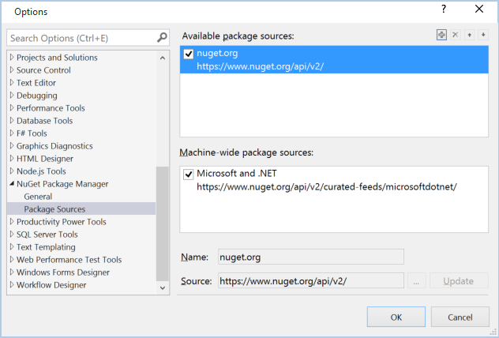

You can find the source code for the asset monitoring sample in the Visual Studio solution named **IoTRefImplementation** in the [azure-iot-solution][iotsolution] GitHub repository). This solution has the following structure:

-   Cloud Services
  -   **EventProcessor**: Groups both the EventProcessor.WorkerRole and DeviceManagement.Web projects in a single cloud service to simplify deployment.
  -   **Simulator**: Contains the Simulator.WorkerRole project.

-   Visual Studio Projects
  -   Common
  -   DeviceManagement.Infrastructure.
  -   DeviceManagement.Web: The Device Administration portal web app.
  -   EventProcessor.WorkerRole: Forwards event data from devices to other back-end services or the Device Administration portal.
  -   Simulator.WorkerRole: Implements simulated devices.

### Provisioning the required Azure services

You must set up the following services in your subscription and provide information from each of these services when you run the Build.cmd script to build the solution.

#### Provision a DocumentDB account
To provision a DocumentDB account:
- Sign in to the [Microsoft Azure Preview portal][previewportal].
- In the Jumpbar, click **New**, then select **Data + storage**, and then click **Azure DocumentDB**.
- In the **New DocumentDB** blade, specify the desired configuration for your DocumentDB account.
  - Enter an account ID of your choice (see the Troubleshooting section at the end of this document for more information about supported Azure storage naming rules).
  - We recommend that you use **East US** as the Location (see the Troubleshooting section at the end of this document for more information about supported Azure regions).
  - Use the default values for all other configuration settings.
- Click **Create**.

*For more information, see [Create a database account][docdb].*

When the portal has finished creating your DocumentDB account, you need to obtain the URI and Primary Key of your DocumentDB account.
- Wait for the portal to finish creating your DocumentDB account.
- On the blade for for your DocumentDB account click **All settings**, and then click **Keys**.
- Keep this browser window open, or make a note of the **URI** and **Primary Key** values. You will need these values when you provision your IoT Hubs solution.

#### Provision a new Azure Active Directory (AAD) service instance

To provision your AAD service:
- Sign in to the [Azure Management portal][azureportal], in the list of services click **Active Directory**, then click **New**, then click **Directory**, and then click **Custom Create**.
- Select **Create new directory**.
- Enter the name, domain name and country or region of your choice.
- Click the checkmark to complete.

Once your AAD is created, complete the following steps to prepare your directory:

First, add two applications to your directory. These enable the Device Administration portal web app to use AAD for authentication and authorization:

1. In the list of directories, click on the directory you just created.
2. Click **Applications** to show the list of applications associated with your directory.
3. Click **Add** (this link is near the bottom of the screen).
4. Click **Add an application my organization is developing**.
  1. For local debugging, create an application with the following properties:
    - A name such as **localhost**, for the type select **Web Application and/or Web API**.
    - Sign-on URL: **https://localhost:44305**
    - App Id URI: **http://localhost/web**
  2. For cloud deployment, create an application with the following properties:
    - A name such as **clouddeployment**, for the type select **Web Application and/or Web API**.
    - Sign-on URL: **https://&lt;deploymentname&gt;eventprocessor.cloudapp.net**  where &lt;deploymentname&gt; is a prefix that uniquely identifies your deployment. You must provide the prefix you choose here when you run the deployment script later in the setup process.
    - App Id URI: **http://&lt;deploymentname&gt;eventprocessor.cloudapp.net/web** where &lt;deploymentname&gt; is the same value you chose in the previous step.

When you have created the two applicatons in your directory, change the manifest file for both AAD applications (**localhost** and **clouddeployment**).
*Note: you must follow all of these steps for both applications.*

1. In the list of directories in the portal, click on the directory you just created.
2. Click **Applications** to show the list of applications associated with your directory. You should see **localhost** and **clouddeployment** in the list.
3. Click on the application whose manifest you want to edit to display the **Quick Start** view for that application.
4. In the **Quick Start** view of the application, click **Manage Manifest** (this link is at the bottom of the screen), then click **Download Manifest** to download the manifest file.
5. Open the downloaded manifest file in a text editor, and replace the contents of the **appRoles** section in the manifest file with the **appRoles** section from the [AppRolesForManifest.txt][newmanifest] file in the [azure-iot-solution][iotsolution] GitHub repository. Then save the new version of the manifest file locally.
6. In the **Quick Start** view of the application, click **Manage Manifest** (this link is at the bottom of the screen), then click **Upload Manifest** to upload your new copy of the manifest file to the portal.
7. Wait for the upload to finish.
8. Now you can assign your users to the roles specified in the manifest by clicking **Users**, selecting a user, and then clicking **Assign** (this link is at the bottom of the screen):
  - Members of the Admin and Device Manager roles can:
    - view devices
    - enable/disable devices
    - edit device metadata
    - add/remove devices
    - send commands to devices
  - Members of the Contributor role can:
    - view devices
    - enable/disable devices
  - Members of the Read Only role can:
    - view devices

You can examine these roles and their permissions in the **DefineRoles** method in the RolePermissions.cs file in the DeviceManagement.Web project. For more information about how to edit the manifest file, see [here][manifestinstructions].

#### Add co-administrators to your Azure subscription (Recommended)
1. Create Directory Mapping
  - In the [Azure management portal] [azureportal], click **Settings** in the list of services on the left-hand side.
  - Select the subscription you'd like to add a co-administrator to.
  - Click **Edit Directory**.  
  - Select the Directory you are using in the dropdown. Click the forward arrow.
  - Confirm the directory mapping and affected co-administrators. *Note: if moving from another directory, all co-administrators from the original directory will be removed.*
2. Add a co-administrator
  - In the [Azure management portal] [azureportal], click **Settings**  in the list of services on the left-hand side.
  - Click **Administrators**.
  - Click **Add**.
  - Enter the email address of the new co-administrator. This individual must already be a user in your associated AAD.

### Use the Build.cmd script to provision the solution

The Build.cmd script in the repository builds the solution code and also deploys the required services to your Azure subscription. If you run Build.cmd without any parameters it will show you the different types of builds you can perform such as:

-   Use `build.cmd local` to build for a local deployment. For more information about how to run this script, see the steps in the section "Steps to provision the solution locally using Build.cmd local" below.

-   Use `build cloud <other params>` to build and deploy the solution to your Azure subscription. For more information about how to run this script, see the steps in the section "Steps to provision the solution in the cloud using Build.cmd cloud" below.

We recommend that you try `Build.cmd local` first. This provisions the required services in Azure and enables you to explore and debug the solution code on your local development machine.

#### Steps to provision the solution locally using Build.cmd local

1.  Use your Git client to pull the latest version of the solution from the [azure-iot-solution][iotsolution] repository.
    For example:
    `git pull origin master`

2.  Open a **Developer Command Prompt for VS2013 as an Administrator**. *Note: We do not recommend using VS2015 preview for provisioning steps.*

3.  Navigate to the root of your local copy of the **azure-iot-solution** repository.

4.  Run `build.cmd local`

5.  The script prompts you for the following information:
  -  Sign in using the credentials for the Azure Subscription in which you provisioned AAD.
  -  Your Azure subscription ID.
  -  Azure Active Directory Tenant. This should be the fully qualified domain name in the format **&lt;youraadtenantname&gt;.onmicrosoft.com**.
  -  Region: **East US 2** (recommended, see the Troubleshooting section at the end of this document for more information about supported Azure regions).
  -  Your IoTHub connection string (Microsoft will provide you with this value for the private preview).
  -  Your IoTHub-EventHub connection string (Microsoft will provide you with this value for the private preview).
  -  Your EventHub name (Microsoft will provide you with this value for the private preview).
  -  Your DocumentDB URI (you made a note of this value when you created your DocumentDB account).
  -  Your DocumentDB primary key (you made a note of this value when you created your DocumentDB account).

6. The script provisions an Azure Storage account, an Azure Service Bus namespace and Stream Analytics Jobs in your Azure subscription.

#### Local Debugging

1.  Run Visual Studio 2013 as Administrator.

2.  Open the IoTRefImplementation.sln Visual Studio solution.

3.  Right-click the EventProcessor project, click **Debug**, then click **Start New Instance** to run the sample in the local compute emulator.

4.  In Internet Explorer, click **Continue to this website**. To avoid the need to do this every time you debug the project, follow these steps (for more information see [How to trust the IIS Express Self-Signed Certificate][iistrust]):
  -  Ensure you are running IE as Administrator.
  -  Click on **Certificate Error**.
  -  Click **View Certificates**.
  -  Click **Install Certificate**.
  -  Click **Current User** for **Store Location**, then click **Next**.
  -  Select **Place all Certificates in the following store**, browse to the  **Trusted Root Certification Authorities** folder, click **OK**, click **Next**, and then click **Finish**.
  -  When prompted with security warning, click **Yes**.

5.  In the Device Administration portal, add a Simulated Device:
  -  Click **+ Add a Device** and follow the prompts to add a new simulated device.
  -  The device status shows **Pending** until you run the simulator.

6.  Run the Simulator Worker Role in a new instance of Visual Studio 2013.
  -  Start a new instance of Visual Studio and open the the IoTRefImplementation.sln Visual Studio solution.
  -  Right-click the Simulator project, click **Debug**, then click **Start New Instance** to run the simulator in the local compute emulator.

#### Observing the behavior of the local solution

You can verify that the two worker roles and one web role are running correctly using the local Compute Emulator UI as shown in the following screenshot:
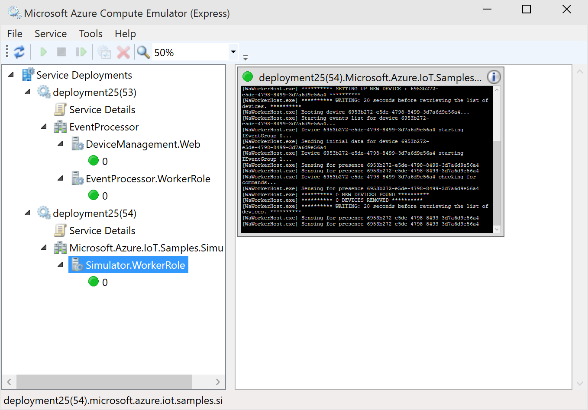

You can view the activities of the Simulator worker role in the local Compute Emulator UI. For example you can see when the simulated device sends telemetry data to the IoT Hub as shown in the following screenshot:
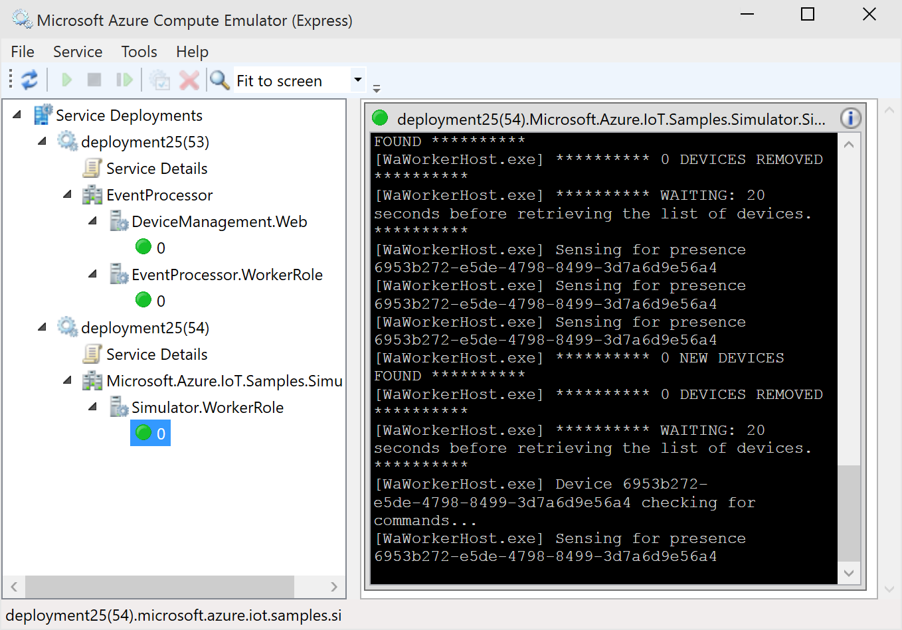

When you first run the sample, there are no configured devices:
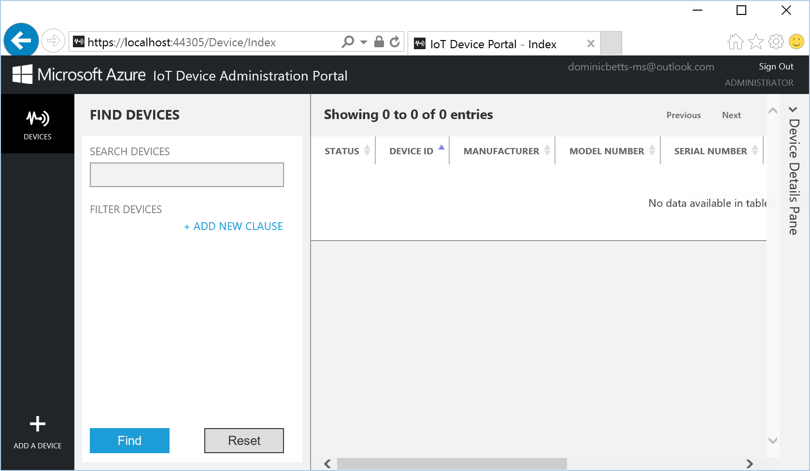

You can use the Device Administration portal to add a new simulated device:
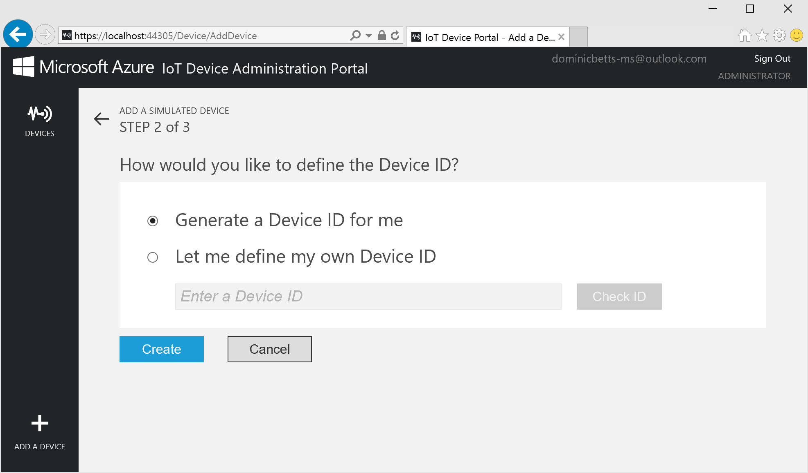

Initially, the status of the new device in the Device Administration portal is **Pending**:
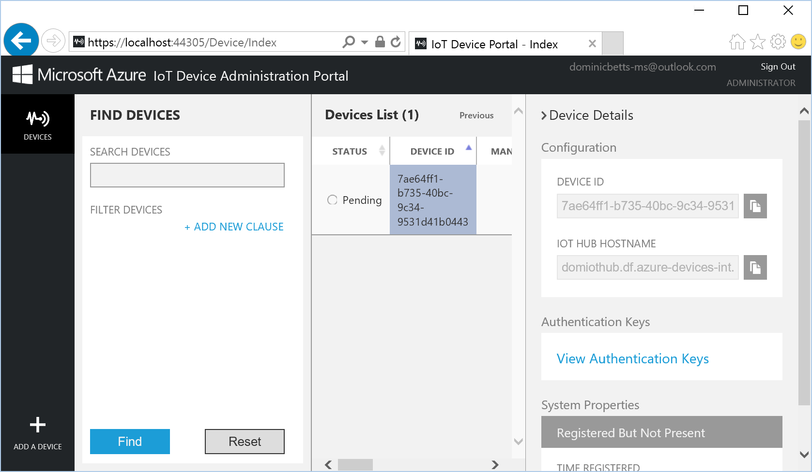

When you run the device simulator, you can see the status of the device changes to **Running** in the Device Administration portal as shown in the following screenshot. The **DeviceInfoFilterJob** Stream Analytics job sends device status information from the device to the Device Administration portal.

Using the Device Administration portal you can also send commands to the device such as updated configuration data or a price change:
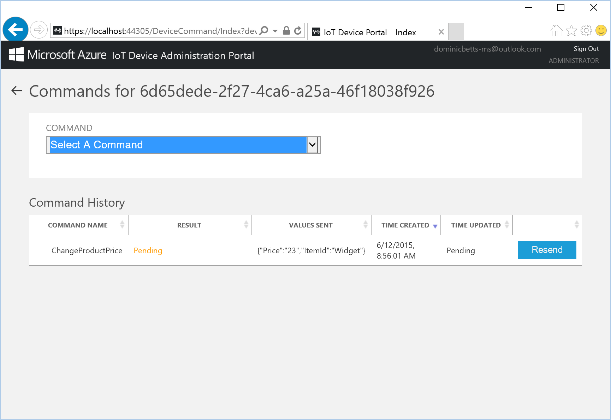

When the device reports it has executed the command successfully, the status changes to **Success**:

Using the Device Administration portal you can search for devices with specific characteristics such as a firmware version:
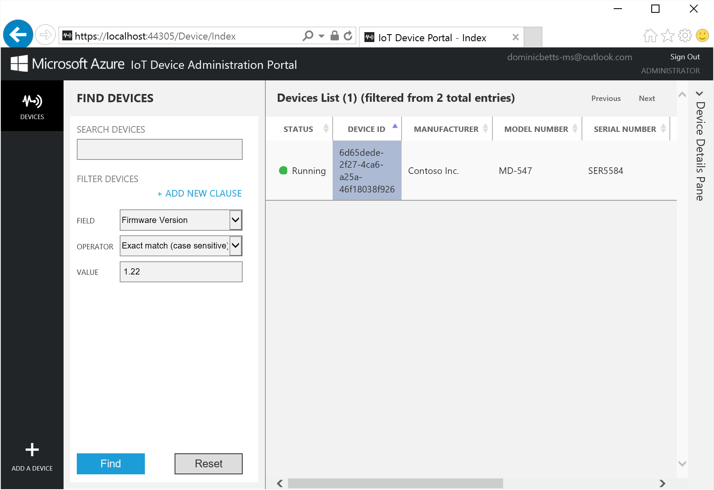

You can disable a device, and after it is disabled you can remove it:
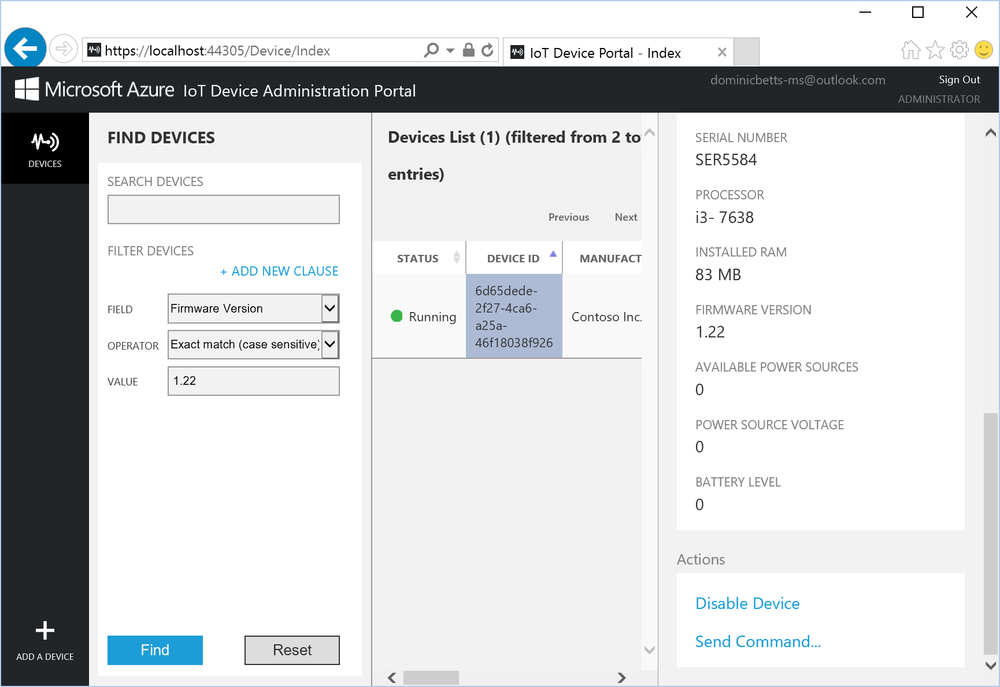

The TelemetryToBlob Stream Analytics job sends the device telemetry data to blob storage. Using the **Server Explorer** window in Visual Studio you can view the contents of the blob as shown in the following screenshot:
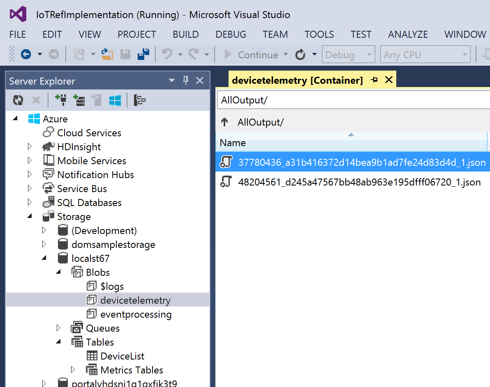

The device simulator worker role uses information in the **DeviceList** table to determine which simulated devices to run:
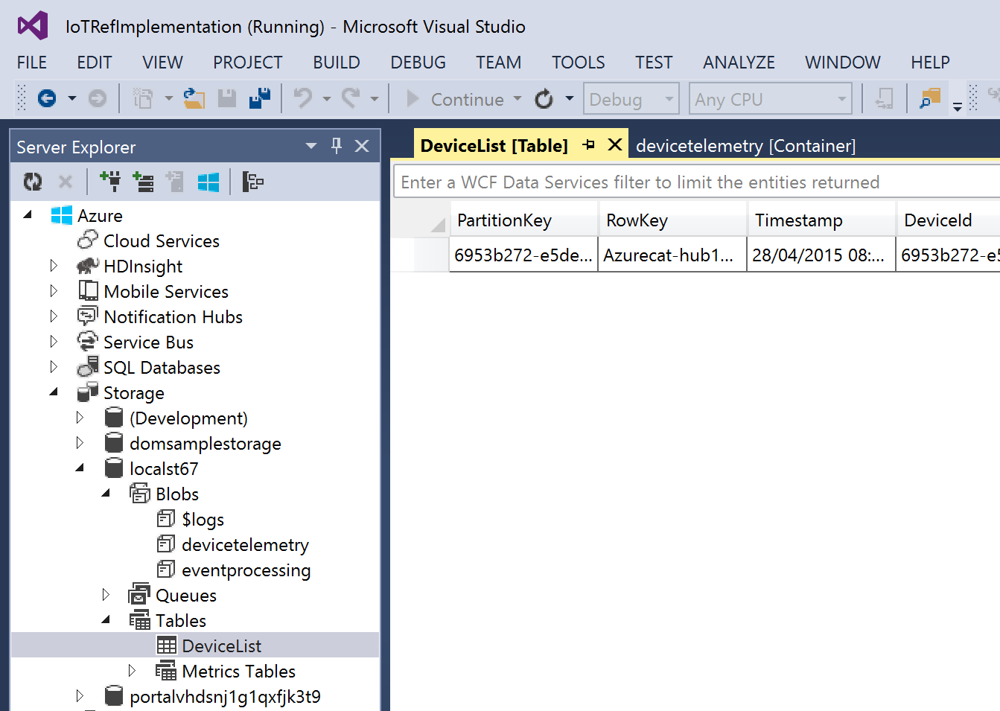

#### Steps to provision the solution in the cloud using Build.cmd cloud

1.  Use your Git client to pull the latest version of the solution from the [azure-iot-solution][iotsolution] repository.
    For example:
    `git pull origin master`

2.  Open a **Developer Command Prompt for VS2013** as Administrator. *Note: We do not recommend using VS2015 preview for provisioning steps.*

3.  Navigate to the root of your local copy of the **azure-iot-solution** repository.

4.  Run `build.cmd cloud [debug | release] <deploymentname>` where  &lt;deploymentname&gt; is the unique prefix you chose when you provisoned your AAD instance.

5.  The script prompts you for the following information:
  -  Sign in using the credentials for the Azure subscription in which you provisioned AAD.
  -  Your Azure subscription ID.
  -  Azure Active Directory Tenant. This should be the fully qualified domain name in the format **&lt;youraadtenantname&gt;.onmicrosoft.com**.
  -  Region: **East US 2** (recommended, see the Troubleshooting section at the end of this document for more information about supported Azure regions).
  -  Your IoTHub connection string (Microsoft will provide you with this value for the private preview).
  -  Your IoTHub-EventHub connection string (Microsoft will provide you with this value for the private preview).
  -  Your EventHub name (Microsoft will provide you with this value for the private preview).
  -  Your DocumentDB URI (you made a note of this value when you created your DocumentDB account).
  -  Your DocumentDB primary key (you made a note of this value when you created your DocumentDB account).

6. The script provisions an Azure storage account, an Azure Service Bus namespace, and a Stream Analytics Job in your Azure subscription.

#### The magic of build.cmd cloud (for the same IoT Hub)

Every time you deploy the solution to the cloud, the script deploys the solution to your staging environment. When deployment to the staging environment completes successfully, the script performs a VIP swap to switch the production and staging environments to make the new version active in production. If deployment to the staging environment fails, the script logs the error and the current production environment stays active running the existing version.

#### Modifying Local to use same settings as Cloud

A local deployment uses different backend resources (Azure Stream Analytics and Event Hub) than a cloud deployment. If you use the same IoT Hub for both local and cloud deployments, device data will randomly go to one or the other of the two sets of backend resources. To avoid this problem, we recommend that if you are using both local and cloud deployments, that you copy the following settings from the cloud configuration file and paste them into the local configuration file to ensure that device telemetry data storage and processing is consistent.

Copy the following values from the `<deploymentname>.config.user` file to the `local.config.user` file in your local copy of the **azure-iot-solution** repository:

-   ServiceStoreAccountName
-   ServiceStoreAccountConnectionString
-   ServiceSBName
-   ServiceSBConnectionString
-   StreamAnalyticsTelemetry
-   StreamAnalyticsDeviceInfo

To move existing simulated devices from your local storage to cloud storage, use Azure Storage Explorer to download the **devicelist** table from the **Local** `<ServiceStoreAccountName>` storage account. Upload the **devicelist** table to the **Cloud** `<ServiceStoreAccountName>` storage account.

If you want to move the device telemetry data, copy the contents from the Local **devicetelemetry** blob container to the Cloud **devicetelemetry** blob container.

You can now delete local storage, Service Bus, and stream analytics jobs using the Azure management portal.

*Note: If you are using Azure Storage Explorer, remove the local storage there first. Then remove the Local ServiceStoreAccountName storage account using the Azure management portal.*

#### Observing the behavior of the cloud solution

When you first run the sample, there are no configured devices:
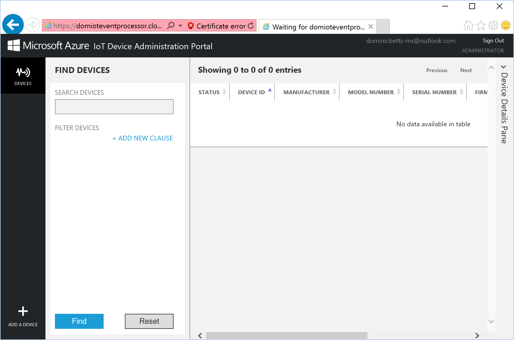

You can use the Device Administration portal to add a new simulated device:
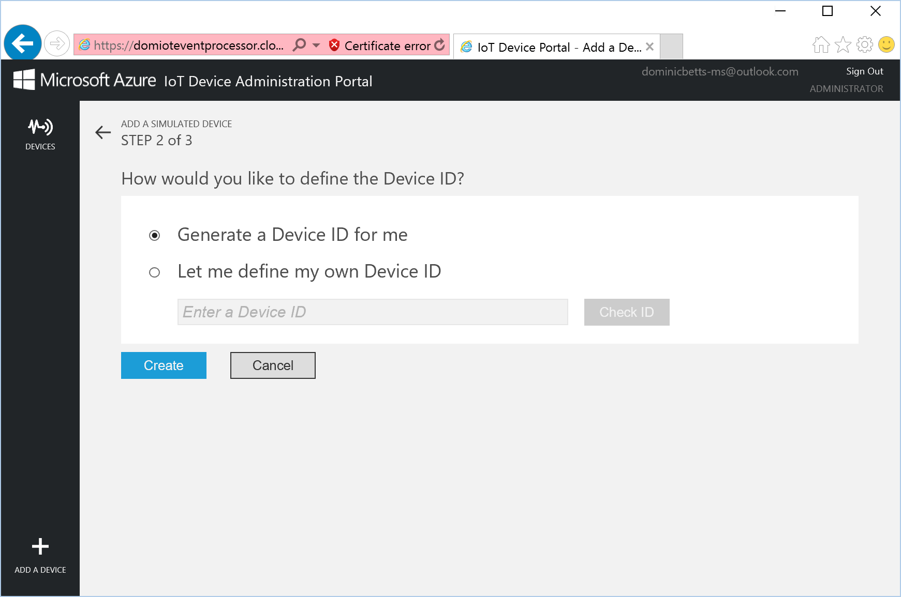

Initially, the status of the new device in the Device Administration portal is **Pending**:
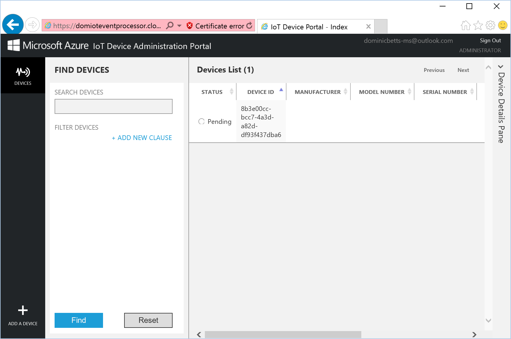

Since the cloud deployment is running the device simulator, you will see the status of the device changes to **Running** in the Device Administration portal as shown in the following screenshot. The **DeviceInfoFilterJob** Stream Analytics job sends device status information from the device to the Device Administration portal.
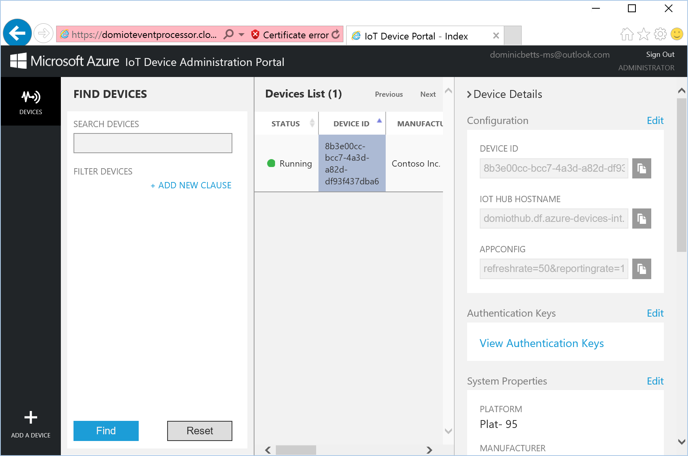

Using the Device Administration portal you can also send commands to the device such as updated configuration data or a price change:
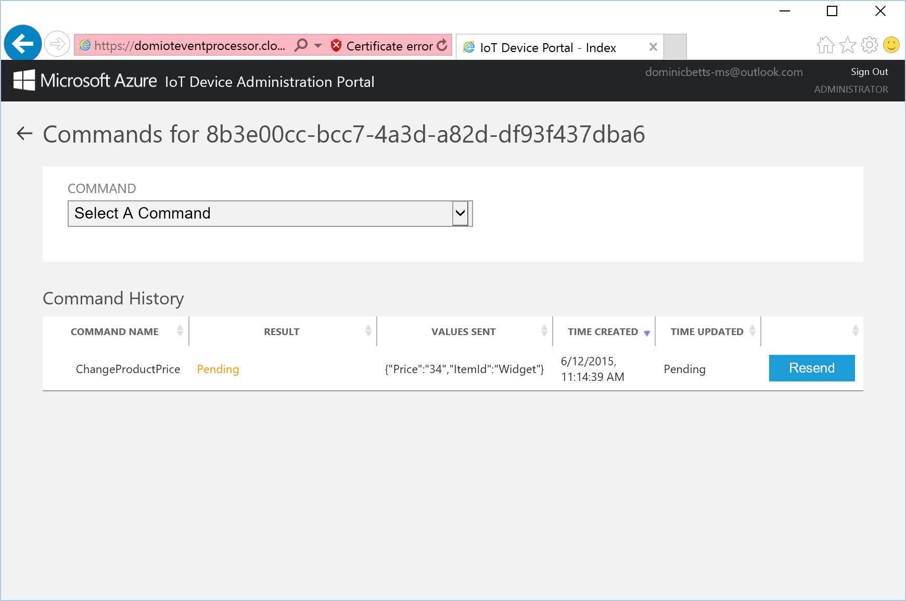

When the device reports it has executed the command successfully, the status changes to **Success**:
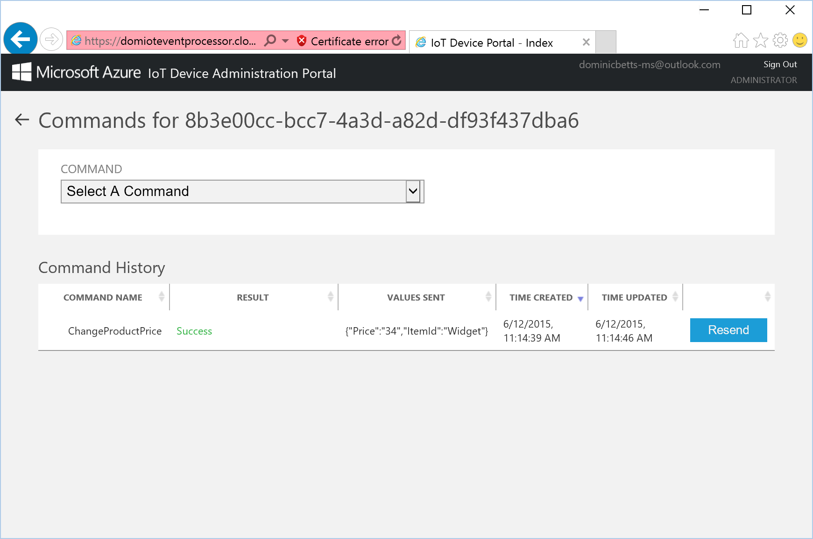

Using the Device Administration portal you can search for devices with specific characteristics such as a model number:
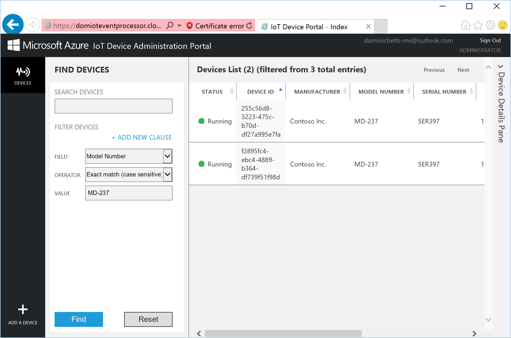

You can disable a device, and after it is disabled you can remove it:
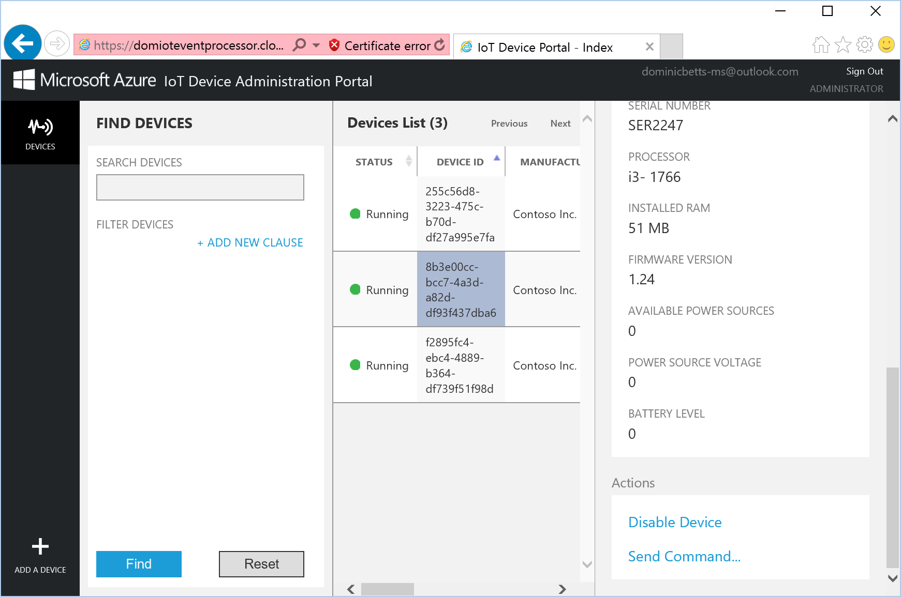

The TelemetryToBlob Stream Analytics job sends the device telemetry data to blob storage. The device simulator worker role uses information in the **DeviceList** table to determine which simulated devices to run. Using the **Server Explorer** window in Visual Studio you can view the contents of these storage resources:
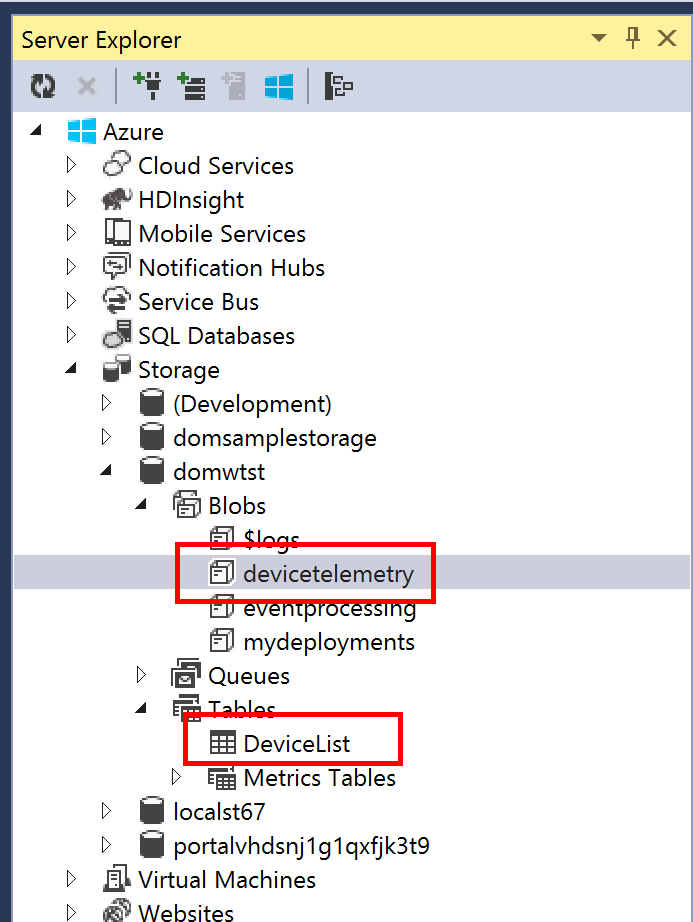

## Using Visual Studio 2013 to navigate and debug the solution code

Ensure that you run Visual Studio 2013 Update 4 as Administrator. This is a requirement to run the solution locally on your development machine.

### The Device Administration portal

After running ‘Build.cmd cloud’, the script displays the path for the Device Administration portal (`https://<deploymentname>simulator.cloudapp.net/`). Navigate to the path for the Device Administration portal, sign in using the account in the Admin role that you created when you provisioned AAD, and you’ll be able to add a device at the bottom left by clicking on **+ Add a Device**.

The Device Administration portal enables you to create simulated devices. When you create a simulated device, the sample solution uses an Azure Storage table to make the simulator aware that you’ve created a device.

When you create your device, you’ll see your device in a 'Pending' state. In order for the device to start sending data, and to transition the state of the device to 'Active', start an instance of the device simulator worker role in a local deployment. See the section 'The Simulated Devices' later in this document.

You can find the code for the device administration portal in the DeviceManagement.Web Visual Studio project.

### The Simulated Devices

Simulated devices are executed inside an Azure Cloud Service as a worker role. In the current implementation of the device simulator worker role, you’ll only need a single worker to create a large number of simulated devices.

You can create many simulated devices from the device administration portal. The simulated devices will automatically startup when a user creates a simulated device in the device administration portal. This automated startup is accomplished through synchronization using an Azure Storage table.

The code that monitors the Azure Storage table is located in the Simulator.WorkerRole Visual Studio project in the WorkerRole.cs file inside the **RunAsync** method. There is a class named **BulkDeviceTester** that creates the simulated devices. You can see the **StartAllDevices** method in the DeviceManager.cs file.

### The Device Specific Events Generated by the Simulated Device

The simulated device generates a number of device specific events that the EventProcessor worker role processes. For example:

-   **The Device Description.** A device describes itself in the following situations:

  -   Every time a device is created. You can find this code in the VendingMachine\\Devices\\Factory\\VendingMachineDeviceFactory.cs file in the Simulator.WorkerRole project. This code buffers a **StartupTelemetry** object, which is sent to the service when the device connects.

  -   After processing a command. You can find this code in the VendingMachines\\CommandProcessors and SimulatorCore\\CommandProcessors folders in the Simulator.WorkerRole Visual Studio project .

-   **Command Response.** Commands can return a response to the cloud. You can initiate sending a command to a device using the Device Administration portal (see the DeviceManagement.Web project).

### Commands

You send commands to the device from the device administration portal. The simulated vending machine device implements command processing logic in the VendingMachine\\Devices\\VendingMachineDevice.cs file in the Simulator.WorkerRole project. The **InitCommandProcessor** method can register multiple command processors.

You’ll notice that there is a single application specific command in the vending machine device CommandProcessor folder. All other commands for this device are defined and handled as core system device commands.

### Core System Device Commands

There are three core system command processors defined in the SimulatedCore\\CommandProcessors folder:

-   ChangeConfig
-   ChangeKey
-   ChangeSystemProperties

### The Azure Stream Analytics Jobs

Azure Stream Analytics is the scalable event stream processing engine used to direct the stream of data from the devices to a number of different locations.

The Build.cmd script provisions the following Azure Stream Analytics jobs:

- Send the entire stream of data to an Azure Storage blob, which can be used for analytics and long-term storage.

- Filter the stream of events for events related to device specific information. This information includes device information and command responses.

You can find the Azure Stream Analytics jobs definitions in the Common\\Deployment folder. They are named DeviceInfoFilterJob.json and TelemetryToBlob.json.

### The Event Processor

The event processor is implemented as an *Event Processor Host*, which is created in the Processors\\DeviceEventProcessor.cs file in the EventProcessor.WorkerRole project. The code that determines the appropriate action to take is in the Processors\\DeviceManagementProcessor.cs file in the **ProcessJToken** method.

## Set up your physical hardware device

Before you can integrate your physical hardware device into the asset monitoring sample, you should learn how to connect your device to an IoT Hub.

The following devices are supported and you can find the setup instructions and other resources in the [azure-iot-suite-sdks][iotsuitesdks] repository:

- Raspberry Pi 2 – Windows 10 - [Set up instructions][setuppiwindows]
- Raspberry Pi 2 – Raspbian - [Set up instructions][setuppiraspian]
- BeagleBone Black – Debian - [Set up instructions][setupbbbdebian]
- BeagleBone Black – Snappy Ubuntu Core - [Set up instructions][setupbbbsnappy]
- Freescale FRDM-K64F – mBed - [Set up instructions][setupmbed]
- Windows 8.1 Desktop (x86 or amd64) - [Set up instructions][setupdesktopwindows]
- Custom Device - [Set up instructions][setupcustom]

## Using your physical hardware device with the asset monitoring sample

In previous steps you connected your hardware device to IoT Hubs and set up the asset monitoring sample to use simulated devices. Now you can connect your physical hardware device to the asset monitoring sample.

You can find the sample code for your hardware device in the [azure-iot-suite-sdks][iotsuitesdks] repository in the iothub_schema_client/samples/asset_monitoring folder.

To connect your hardware device to the asset monitoring sample:

1. Create a new device in the Device Administration portal and obtain your device name, device id, and device key.

2. Add the device informationin either the main.c or main.cpp file in the folder that corresponds to your device type in the iothub_schema_client/samples/asset_monitoring folder.

3. Build and deploy the asset monitoring client to your hardware device.

## Configuration Reference

When you run the `build.cmd` script, it stores the configuration information you provide in one of two configuration files:

- **local.config.user**: This file stores the configuration settings the sample uses for a local deployment.
- **&lt;deploymentname&gt;.config.user**: This stores the configuration the sample uses for a cloud deployment where &lt;deploymentname&gt; is a value you provide to the script.

These files store configuration settings such as :

| Setting        | Description                                                 |
|----------------|-------------------------------------------------------------|
| AADTenant      | Your AAD domain. For example, mydomain.onmicrosoft.com      |
| AADAudience    | The **APP ID URI** for the AAD application you defined      |
| AADMetadataAddress | The address of the **FEDERATION METADATA DOCUMENT** for your AAD application. You can find this in the list of App Endpoints for your application in the Azure portal |
| AADRealm       | The **APP ID URI** for the AAD application you defined      |
| DocDbEndPoint  | The **URI** of your DocumenDB. You can find this in the list of *Keys** for your DocumentDB account |
| DocDBKey       | The **PRIMARY KEY** of your DocumenDB. You can find this in the list of *Keys** for your DocumentDB account |
| DeviceHubName  | The **Host name** of your IoT Hub                           |
| DeviceHubKey   | The **Shared Access Key** for your IoT Hub                  |
| EventHubName   | The **NAME** of the Event Hub associated with your IoT Hub  |
| EventHubConnectionString | The **CONNECTION STRING** for your Event Hub from the *Connection Information** in the Azure portal |

## Troubleshooting

You should ensure that Event Hub used by IoT Hub has only a single copy of each of the Stream Analytics jobs receiving data from it. Otherwise, telemetry data is received randomly by one or the other job.

You should deploy the sample to the **East US 2** region to ensure that the Stream Analytics jobs run correctly. Not all Azure regions support the '2015-03-01-preview' version of the Stream Analytics API used by the sample.

The following table shows the regions that support the services the solution requires. The blue boxes show the recommended regions for each service. Due to capacity restraints, we recommend that you avoid the West US region if possible.

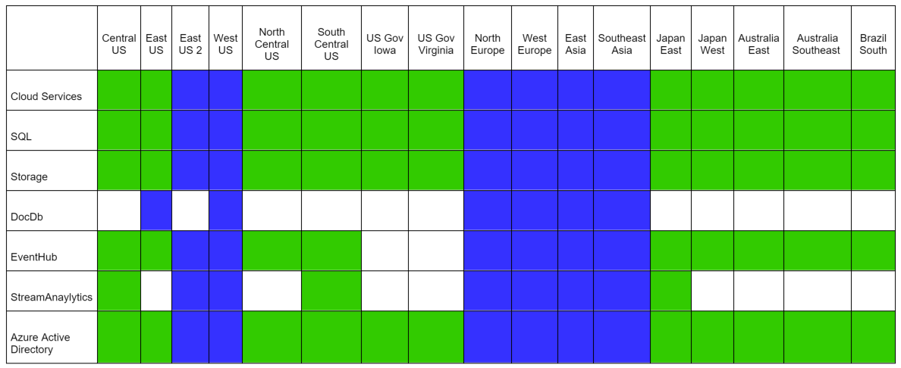

**Visual Studio 2013 - Azure SDK 2.5.1** has a known issue where it fails to install all assemblies. If you get a build error about missing Azure Package assembly, you should uninstall 2.5.1 Azure Authoring Tools and reinstall, then the missing binaries will be installed correctly. [More Information][sdk251issue]  

**NuGet packages fail to download** - If NuGet packages fail to download, open the **IoTRefImplementation** Visual Studio solution, right-click on the solution in **Solution Explorer**, click **Manage NuGet Packages for Solution**, and then click **Settings**. Make sure **nuget.org** is selected in the list of available package sources.

**Two browser windows open when you run the local solution** - When you run the **EventProcessor** locally, you see two browser windows open with addresses simillar to the following:

- http://localhost:30454/
- https://localhost:44305/

The browser reports that the http address cannot be displayed. To prevent this page opening, in **Solution Explorer**, expand the **EventProcessor** project, then expand the **Roles** folder, then right-click on **DeviceManagement.Web**, and then click **Properties**. In the **Configuration** panel, unselect **Launch browser for HTTP endpoint**, then save your changes.

**Azure storage naming rules** - For more information about the naming rules for Azure storage, see the blog post [Azure Storage Naming Rules][storagenamingrules].

**Cloud Service Debugging** - You may see the following Error when you run https://`<deploymentname>`eventprocessor.cloudapp.net as shown in the following screenshot.
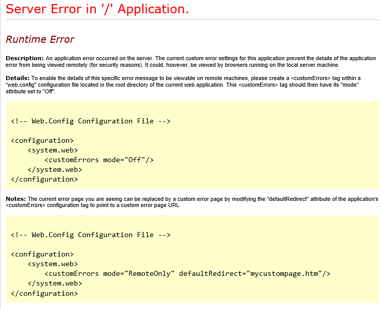

You'll notice in the Web.config file that **customErrors** is set to **RemoteOnly**. Turn **customErrors** off to discover what the exception is.
You can use remote desktop to connect to the instance with errors and troubleshoot.

To configure remote desktop:

1. Go to the [Azure management portal] [azureportal], navigate to the on the **EventProcessor** Cloud Service.
2. Click **Configure**.
3. Click **Remote**.
4. Check **Enable Remote Desktop**.
5. Create your credentials.
6. In the dropdown for the certificate, select **Create a new certificate**.
7. Set an expiration of your choice.

After you have configured remote desktop, you can connect to the instance:

1. In the [Azure management portal] [azureportal], navigate to the on the **EventProcessor** Cloud Service.
2. Click **Instances**.
3. Select **DeviceManagement.Web_IN_0**, click **Connect**.
4. Sign-in with the credentials you setup for remote desktop access.
6. Open File Explorer and open the (E: | F:) drive.
7. Open sitesroot/0/Web.config in Notepad.
8. Set `<customErrors mode="RemoteOnly" />` to `<customErrors mode="Off" />`.
9. Save the file.
10. Refresh `https://<deploymentname>eventprocessor.cloudapp.net` in your browser to view the exception messages.
11. When you have finished troubleshooting, replace the configuration setting `<customErrors mode="RemoteOnly" />` in the sitesroot/0/Web.config file.

[previewportal]: https://portal.azure.com "Microsoft Azure Preview Portal"
[iotsuitesdks]: https://github.com/Azure/azure-iot-suite-sdks "Azure IoT Suite SDKs"
[iotsolution]: https://github.com/Azure/azure-iot-solution "Azure IoT Suite Solution"
[twofactor]: https://help.github.com/articles/about-two-factor-authentication/ "GitHub two-factor authentication"
[accesstoken]: https://help.github.com/articles/creating-an-access-token-for-command-line-use/ "Greate an access token"
[setuppiwindows]: https://github.com/Azure/azure-iot-suite-sdks/blob/master/doc/raspberrypi2_windows10_setup.md
[setupcustom]: https://github.com/Azure/azure-iot-suite-sdks/blob/master/doc/how_to_port_the_c_libraries_to_other_platforms.md
[setupdesktopwindows]:https://github.com/Azure/azure-iot-suite-sdks/blob/master/doc/windows_setup.md
[setuppiraspian]: https://github.com/Azure/azure-iot-suite-sdks/blob/master/doc/raspberrypi_raspbian_setup.md
[setupbbbdebian]: https://github.com/Azure/azure-iot-suite-sdks/blob/master/doc/beagleboneblack_debian_setup.md
[setupbbbsnappy]: https://github.com/Azure/azure-iot-suite-sdks/blob/master/doc/beagleboneblack_ubuntu_snappy_setup.md
[setupmbed]: https://github.com/Azure/azure-iot-suite-sdks/blob/master/doc/mbed_setup.md)
[azureportal]: https://manage.windowsazure.com "Windows Azure Portal"
[newmanifest]: https://github.com/Azure/azure-iot-solution/blob/master/AppRolesForManifest.txt
[manifestinstructions]: https://github.com/AzureADSamples/WebApp-RoleClaims-DotNet#step-2-define-your-application-roles "Instructions for editing manifest file"
[iistrust]: http://blogs.msdn.com/b/robert_mcmurray/archive/2013/11/15/how-to-trust-the-iis-express-self-signed-certificate.aspx
[sdk251issue]: http://stackoverflow.com/questions/29281710/azure-sdk-2-5-1-fails-to-publish-cloudservice
[docdb]: http://azure.microsoft.com/en-us/documentation/articles/documentdb-create-account/ "How to create a DocumentDB database account"
[powershell]: http://azure.microsoft.com/en-us/documentation/articles/powershell-install-configure/
[azuresdkdownload]: http://azure.microsoft.com/en-us/downloads/archive-net-downloads/
[storagenamingrules]: http://blogs.msdn.com/b/jmstall/archive/2014/06/12/azure-storage-naming-rules.aspx
