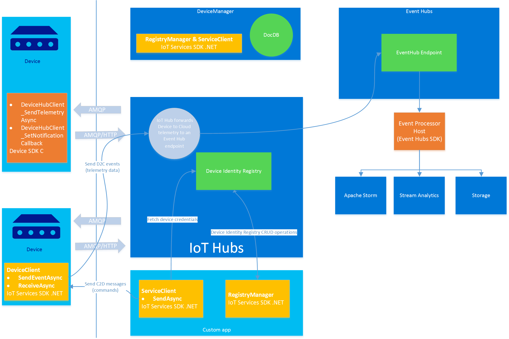

# How to use Azure IoT Hubs (private preview)

## Introduction

The Azure IoT Hubs private preview cloud-hosted service enables you connect millions of devices to multiple back-end services through a bi-directional communications channel. In addition, you can use a .NET SDK for programmatic access to the services offered by IoT Hubs.

At a high level, IoT Hubs provides the following features and functions:

- A device identity registry that stores device identities and security credentials. You can use this identity registry to manage individual device access to IoT Hubs functionality through access controls and device blacklisting.

- As a receiver of Device to Cloud (D2C) telemetry messages, IoT Hubs:
  - Uses the AMQP or HTTP/1 device protocols.
  - Guarantees at-least-once delivery, and supports a message retention period of up to 30 days.
  - Forwards messages at very high throughput to Azure Event Hubs.

- As a sender of Cloud to Device (C2D) messages, IoT Hubs:
  - Uses only the AMQP device protocol.
  - Guarantees at-least-once delivery using a per-device queue.

- To secure access to the service, IoT Hubs uses Shared Access Signatures (SAS)to provide role-based access.

- The *.NET IoT Services SDK* (described in this document) that enables you to:
  - Manage IoT Hubs security rules.
  - Manage device identities, keys, and blacklists.
  - Send C2D messages.
  - Receive C2D messages as a device.
  - Send D2C messages as a device.
  - Receive D2C telemetry in the cloud, using Event Hubs.

- A C-based Device SDK that enables you to communicate with IoT Hubs from your devices (described in a separate document in the [Azure IoT Device SDK](https://github.com/Azure/azure-iot-suite-sdks) repository.)

This document describes how to access IoT Hubs, and how to interact with IoT Hubs using the key components of the .NET IoT Services SDK. This document also walks you through the tasks you must complete in order to use IoT Hubs in your own solution.

## Architecture

The following diagram summarizes the key elements of a solution that uses IoT Hubs and describes the relationships between those components.



### Devices

Devices can send D2C event data to IoT Hubs using either the AMQP or HTTP/1 protocols and receive C2D messages from IoT Hubs using the AMQP protocol. To send and receive messages on the device, you can use the following APIs:

- The .NET IoT Services SDK includes a [**DeviceClient**](#deviceclient) class described later in this document.

- The [Azure IoT Device SDK](https://github.com/Azure/azure-iot-suite-sdks) includes C libraries that you can compile for multiple client platforms.

For more information, see [Sending and receiving telemetry data](#sending-and-receiving-telemetry-data) later in this document.

### IoT Hubs

IoT Hubs can send C2D messages to devices. To send C2D messages, you can use the [**ServiceClient**](#serviceclient) class in the .NET IoT Services SDK. For more information, see [Sending and receiving C2D messages](#sending-and-receiving-c2d-messages) later in this document.

IoT Hubs forwards D2C event data to an Event Hub. You provide details of this Event Hub in the IoT Hubs configuration.

IoT Hubs maintains a device identity registry. You can interact with this identity registry using the [**RegistryManager**](#registrymanager-class) class in the .NET IoT Services SDK (described in this document)

### Event Hubs

You use Azure Event Hubs to process D2C messages. Typically, you use the **EventProcessorHost** class in the AzureSDK to receive these D2C messages and deliver them for processing or storage.

### Device Manager

IoT Hubs solutions typically include a custom Device Manager app to enable additional device management functionality not provided by the IoT device identity registry. For more information, see [Managing the device identity registry](#managing-the-device-identity-registry).

## Security and claims

IoT Hubs security is centered on *claims*. Claims grant users the right to perform certain operations. The following table lists the claims supported by IoT Hubs in the private preview.

| Claim          | Description                                                                        |
|----------------|------------------------------------------------------------------------------------|
| Manage         | Enables the management of IoT Hubs properties such as security rules     |
| RegistryRead   | Enables read access to the device identity registry                             |
| RegistryWrite  | Enables write access to the device identity registry                            |
| ServiceConnect | Enables listening for and sending messages on the cloud-side endpoints   |
| DeviceConnect  | Enables listening for and sending messages on the device-side endpoints. |

You can use a Shared Access Signature (SAS) token to obtain any of the claims listed in the table. The [SAS security model](https://msdn.microsoft.com/en-us/library/azure/dn170477.aspx) is analogous to the model used for Event Hubs. The IoT Hubs SDKs handle all the token generation logic. The configuration of the SAS authorization rules (associating keys with granted claims) happens at the level of an individual IoT Hub, and can be performed using the .NET SDK described in this document.

The **DeviceConnect** claim is special because, in addition to obtaining it using a SAS rule, it can also be obtained with credentials set in the device identity registry. When using a per-device key, the client will be able to perform operations only on behalf of a specific device (in other words it can only receive messages targeted at that specific device). Both the **DeviceClient** class in the .NET SDK and the C Device SDK can authenticate using this method.

An IoT Hub is provisioned with an authorization rule that grants all the claims.

## SDKs

This section describes the .NET IoT Services SDK and the Event Hubs API (part of the Azure .NET SDK). Note that the Device SDK in C is described in a separate document in the [Azure IoT Device SDK](https://github.com/Azure/azure-iot-suite-sdks) repository.

### .NET IoT Services SDK

The following reference information describes the key classes in the .NET IoT Services SDK.

---
#### RegistryManager class

Use the **RegistryManager** class to manage the device identity registry in IoT Hubs.

#### RegistryManager constructor

| | |
|------------------|----------------------------------------------------------------------------------------------|
| Method signature | `public static RegistryManager CreateFromConnectionString(string connectionString);`|
| Inputs           | connectionString: connection string granting **RegistryRead** or **RegistryReadWrite** claim |
| Outputs          | An instance of **RegistryManager**                                                           |
| Exceptions       | TODO                                                                                         |

#### RegistryManager methods

**Open/Close** methods. _Note: **RegistryManager** instances should be opened and closed properly to avoid resource leaks._

| | |
|------------------|------------------------------------|
| Method signature | `public abstract Task CloseAsync();` |
| Inputs           | --                                 |
| Outputs          | --                                 |
| Exceptions       | TODO                               |

**AddDeviceAsync** method

| | |
|------------------|----------------------------------------------------------------------------------------------------|
| Method signature | `public abstract Task<Device> AddDeviceAsync(Device device);`<br/>`public abstract Task<Device> AddDeviceAsync(Device device, CancellationToken cancellationToken);`  |
| Inputs           | device: instance of **Device** class (read-only properties will be ignored by the service)                                               |
| Outputs          | An **Device** instance if the device is successfully created                                       |
| Exceptions       | TODO                                                                                               |

**GetDeviceAsync** method

| | |
|------------------|------------------------------------------------------------------------------------------------------|
| Method signature | `public abstract Task<Device> GetDeviceAsync(string deviceId);`<br/>`public abstract Task<Device> GetDeviceAsync(string deviceId, CancellationToken cancellationToken);`  |
| Inputs           | deviceId: device id of the device to retrieve                                                        |
| Outputs          | A **Device** instance or null if the device is not found                                             |
| Exceptions       | TODO                                                                                                 |

**GetDevicesAsync** method

| | |
|------------------|----------------------------------------------------------------------------------------------------------------------------------------------|
| Method signature | `public abstract Task<System.Collections.Generic.IEnumerable<Device>> GetDevicesAsync(int maxCount);`<br/>`public abstract Task<System.Collections.Generic.IEnumerable<Device>> GetDevicesAsync(int maxCount, CancellationToken cancellationToken);`  |
| Inputs           | maxCount: the max number of devices to retrieve.                                                                                             |
| Outputs          | Collection of retrieved **Device** instances, up to 100 (irrespective of maxCount value).                                                    |
| Exceptions       | TODO                                                                                                                                         |

**UpdateDeviceAsync** method

| | |
|------------------|-------------------------------------------------------------------------------------------------------------------------|
| Method signature | `public abstract Task<Device> UpdateDeviceAsync(Device device);`<br/>`public abstract Task<Device> UpdateDeviceAsync(Device device, bool forceUpdate);`<br/>`public abstract Task<Device> UpdateDeviceAsync(Device device, CancellationToken cancellationToken);`<br/>`public abstract Task<Device> UpdateDeviceAsync(Device device, bool forceUpdate, CancellationToken cancellationToken);`  |
| Inputs           | device: a **Device** instance (read-only properties will be ignored by the service) <br/>forceUpdate: ignore ETag if true                                                                                         |
| Outputs          | A **Device** instance                                                                                                   |
| Exceptions       | TODO                                                                                                                    |

**RemoveDeviceAsync** method

| | |
|------------------|-----------------------------------------------------------------------------------------------|
| Method signature | `public abstract Task RemoveDeviceAsync(string deviceId);`<br/>`public abstract Task RemoveDeviceAsync(string deviceId, CancellationToken cancellationToken);`  |
| Inputs           | deviceId: deviceId of the device to delete                                                    |
| Outputs          | --                                                                                            |
| Exceptions       | TODO                                                                                          |

---
#### Device class

The **Device** class is the main data transfer object for the **RegistryManager** class. It has the following properties:

| Property name               |                                | Description                                                                                                                                                                      |
|-----------------------------|--------------------------------|----------------------------------------------------------------------------------------------------------------------------------------------------------------------------------|
| DeviceId                    | required, read-only on updates | A case-sensitive string (up to 128 char long) of ASCII 7-bit alphanumeric chars + {'-', ':', '.', '+', '%', '\_', '\#', '\*', '?', '!', '(', ')', ',', '=', '@', ';', '$', '''}. |
| Etag                        | required, read-only            | A string representing a weak etag version of this json description. Enables                                                                                            |
| Authentication.SymmetricKey | optional                       | Symmetric key to be used to authorize this device. This can also be an array (up to 2) of keys to do key rollover. Format is the same as DeviceId.                                                                                                                                                       |
| State                       | required                       | "Enabled", "Disabled". If "Enabled", this device is authorized to connect. If "Disabled" this device cannot receive or send messages, and **StateReason** must be set.           |
| StateReason                 | optional                       | A 128 char long string storing the reason of suspension. (all UTF-8 chars allowed).                                                                                              |
| StateUpdatedTime            | read-only                      | Datetime of last time the state was updated.                                                                                                                                     |
| ConnectionState             | read-only                      | "connected",  "disconnected"                                                                                                                                                   |
| ConnectionStateUpdatedTime  | read-only                      | Datetime of last time the connection state was updated.                                                                                                                          |
| LastActivityTime            | read-only                      | Datetime of last time the device authenticated, received, or sent a message.                                                                                                     |

**JSON example**

```
{
  DeviceId: "devA",
  Etag: "abcdef",
  Authentication: {
    SymmetricKey: {
      PrimaryKey: "123",
      SecondaryKey: "234"
    }
  },
  State: "Enabled",
  StateReason: "provisioned",
  ConnectionState: "connected",
  ConnectionStateUpdatedTime: "2015-02-28T16:24:48.789Z",
  LastActivityTime: "2015-02-30T16:24:48.789Z"
}
```

---
#### ServiceClient class

Use the **ServiceClient** class to send C2D messages.


#### ServiceClient constructor

| | |
|------------------|--------------------------------------------------------------------------------------|
| Method signature | `public static RegistryManager CreateFromConnectionString(string connectionString);`   |
| Inputs           | connectionString: connection string granting RegistryRead or RegistryReadWrite claim |
| Outputs          | A **ServiceClient** instance                                                         |
| Exceptions       | TODO                                                                                 |

#### ServiceClient methods

**OpenAsync/CloseAsync** method. _Note: **ServiceClient** instances should be opened and closed properly in order to avoid resource leaks._

| | |
|------------------|------------------------------------|
| Method signature | `public abstract Task OpenAsync();`<br/>`public abstract Task CloseAsync();`  |
| Inputs           | --                                 |
| Outputs          | --                                 |
| Exceptions       | TODO                               |

**SendAsync** method


| | |
|------------------|-------------------------------------------------------------------|
| Method signature | `public abstract Task SendAsync(string deviceId, Message message);` |
| Inputs           | deviceId: device id of the recipient of this message<br/>message: the **Message** instance to be delivered as a message     |
| Outputs          | --                                                                |
| Exceptions       | TODO                                                              |

---
#### Message class

The **ServiceClient** class uses the **Message** class to encapsulate the messages it sends. The **Message** class has a set of pre-defined properties, some app-specified string properties, and an opaque binary body.

Fix

|                | Type                          | Description                                                                                                                                                                              |
|----------------|-------------------------------|------------------------------------------------------------------------------------------------------------------------------------------------------------------------------------------|
| Message Id     | string                        | [**Required for two way requests**] Used to correlate two-way communication.<br/>Format: A case-sensitive string ( up to 128 char long) of ASCII 7-bit alphanumeric chars + {'-', ':',’.', '+', '%', '\_', '\#', '\*', '?', '!', '(', ')', ',', '=', '@', ';', '$', '''}.  |
| To             | string                        | Destination of the message                                                                                                                                                               |
| Correlation id | string                        | Used in message responses and feedback                                                                                                                                                   |
| Operation      | string                        | [**Optional**] Used to specify the role of the message in the communication pattern. Possible values:<br/>"d2c": telemetry message (device to cloud)<br/>"c2d": notification                                                                                                                                                                       |
| Properties     | IDictionary&lt;string, string&gt; | A bag of user-defined properties. Value can only be strings.                                                                                                                             |
| *Body*         | Byte[]                        | A message                                                                                                                                                                                |
---
#### DeviceClient

The **DeviceClient** class uses the same **Message** class as the **ServiceClient** class to represent a message.

#### DeviceClient constructor

| | |
|------------------|--------------------------------------------------------------------------------------------------------------------------------------------|
| Method signature | `public static DeviceClient CreateFromConnectionString(string connectionString, string deviceId);`<br/>`public static DeviceClient CreateFromConnectionString(string connectionString, string deviceId, DeviceClient.TransportType transportType);`  |
| Inputs           | connectionString: connection string granting **DeviceConnect** permissions<br/>deviceId: the deviceId this device client is going to represent.<br/>transportType: AMQP or HTTP                                                                                                                 |
| Outputs          | A **DeviceClient** instance                                                                                                                |
| Exceptions       | TODO                                                                                                                                       |

Note: the connection string includes endpoint and security details.

#### DeviceClient methods

**OpenAsync/CloseAsync** methods. _Note: **DeviceClient** instances should be opened and closed properly to avoid resource leaks._

| | |
|------------------|------------------------------------|
| Method signature | `public abstract Task OpenAsync();`<br/>`public abstract Task CloseAsync();`  |
| Inputs           | --                                 |
| Outputs          | --                                 |
| Exceptions       | TODO                               |

**SendEventAsync** method

Use to send telemetry events.

| | |
|------------------|------------------------------------------------------------------------------------------------|
| Method signature | `public abstract Task SendEventAsync(Message message);`                                          |
| Inputs           | The **Message** instance representing the event to send. No special properties need to be set. |
| Outputs          | --                                                                                             |
| Exceptions       | TODO                                                                                           |

**ReceiveAsync/AbandonAsync/CompleteAsync** methods

Use the **ReceiveAsync** method to receive C2D messages.

| | |
|------------------|--------------------------------------------------------------------------------------------|
| Method signature | `public abstract Task<Message> ReceiveAsync();`<br/>`public abstract Task<Message> ReceiveAsync(TimeSpan timeout);`                             |
| Inputs           | Timeout: the amount of time to wait before returning null. Default value if not specified. |
| Outputs          | The received **Message** instance, null if a timeout occurs.                               |
| Exceptions       | TODO                                                                                       |

Received messages should be completed or abandoned using the **AbandonAsync** or **CompleteAsync** methods.

| | |
|------------------|-------------------------------------------------------|
| Method signature | `public abstract Task AbandonAsync(string lockToken);`<br/>`public abstract Task CompleteAsync(string lockToken);`  |
| Inputs           | lockToken: a property of the received message         |
| Outputs          | --                                                    |
| Exceptions       | TODO                                                  |

**Note**: abandoned messages are re-enqueued in the per-device queue, and the **DeviceClient** instance receives them again.

### Event Hubs API

Each IoT Hub exposes an Event Hubs endpoint to enable an application back-end to receive telemetry data from your devices. This enables you to use the Event Hubs API to receive telemetry data. *Note: The Event Hubs API is part of the Azure .NET SDK.*

Refer to [Event Hubs Programming Guide](https://msdn.microsoft.com/en-us/library/azure/dn789972.aspx) for more information. Especially important is the **Event Processor Host** section that describes how to receive event data.

## Managing the device identity registry
<a name="managing-the-device-identity-registry"></a>

The device identity registry of an IoT Hub contains an entry for every device that can connect to the hub. A device entry holds information such as the device Id, per-device security materials, and a **State** flag that determines whether a device can connect to the IoT Hubs (you can use this to blacklist potentially malicious devices, or to implement a multi-stage provisioning process).

The **RegistryManager** class implements simple CRUD operations that enable you to manage device entries in the IoT Hubs device identity registry.

**Important**: You can only use a device Id to query the IoT Hubs device identity registry. Listing devices is also limited to just a few devices. It is important to have a separate enumerable store for all the devices in your system (for an example, see the [DeviceManagement](https://github.com/Azure/azure-iot-solution/tree/master/DeviceManagement) project in this repository. Use the device identity registry in the IoT Hubs, only for storing security information and to whitelist/blacklist devices.


The following example creates a device entry in the IoT Hubs device identity registry.

```
RegistryManager registryManager = null;
Exception ex = null;
try
{
  registryManager = RegistryManager.CreateFromConnectionString("connection string");
  string deviceId = "";
  var retrieved = await registryManager.GetDeviceAsync(deviceId);
  var device = new Device()
  {
    Id = "",
    Authentication = new AuthenticationMechanism()
    {
      SymmetricKey = new SymmetricKey()
      {
        PrimaryKey = ""
      }
    },
    State = DeviceState.Enabled
  };
  var created = await registryManager.AddDeviceAsync(device);
}
catch (Exception e)
{
  ex = e;
}
if (registryManager != null) await registryManager.CloseAsync();
if (ex != null) throw ex;
```

## Sending and receiving telemetry data

### Using the DeviceClient class to send telemetry data

To send D2C events from a device client, create a new **DeviceClient** instance and then use the **SendEvent** method.

The following code sample shows how to send D2C events from a device client:

```
DeviceClient deviceClient = null;
Exception ex = null;
try
{
  var deviceId = "deviceId";
  var connectionString = new DeviceHubConnectionStringBuilder();
  connectionString.CredentialScope = CredentialScope.Device;
  connectionString.CredentialType = CredentialType.SharedAccessSignature;
  connectionString.HostName = "<IoT Hubs endpoint>";
  connectionString.SharedAccessKey = "<device key>";
  deviceClient = DeviceClient.CreateFromConnectionString(connectionString.ToString(), deviceId);
  await deviceClient.OpenAsync();
  // telemetry
  var message = new Message(Encoding.ASCII.GetBytes("my message body"))
  {
    MessageId = "myMessageId",
    CorrelationId = "correlationId"
  };
  message.Properties["myProperty"] = "my property value";
  await deviceClient.SendEventAsync(message);
}
catch (Exception e)
{
  ex = e;
}
if (deviceClient != null) await deviceClient.CloseAsync();
if (ex != null) throw ex;
```

### Send D2C telemetry data from a device using C

For more information about this scenario, please see the documentation in the [Azure IoT Device SDK](https://github.com/Azure/azure-iot-suite-sdks) repository.

### Receiving D2C telemetry data from devices

IoT Hubs exposes telemetry data as an Event Hubs endpoint. In this private preview release, we will provide you with an Event Hubs connection string to use in order to access telemetry data from your devices.

Event Hubs supports several different ways to read and process telemetry data. To learn more, the best resources are the Event Hubs getting started guides such as the following:

-   [Get Started with Event Hubs with C\# and Event Processor Host](http://azure.microsoft.com/en-us/documentation/articles/service-bus-event-hubs-csharp-ephcs-getstarted/#receive-messages-with-eventprocessorhost)

-   [Get Started with Event Hubs with C\# and Storm](http://azure.microsoft.com/en-us/documentation/articles/service-bus-event-hubs-csharp-storm-getstarted/)

-   [Get Started with Stream Analytics](http://azure.microsoft.com/en-us/documentation/articles/stream-analytics-get-started/), assuming you already have an Event Hubs connection string.

## Sending and receiving C2D messages

### Sending a C2D message

Use the **ServiceClient** class to send a C2D message. We will provide you with a connection string for your IoT Hubs that grants the claims required to send C2D messages.

The following code sample shows how to send a C2D message:

```
ServiceClient serviceClient = null;
Exception ex = null;
try
{
  serviceClient = ServiceClient.CreateFromConnectionString("<connection string>");
  await serviceClient.OpenAsync();
  var message = new Message(Encoding.ASCII.GetBytes("my message body"))
  {
    MessageId = "myMessageId",
    CorrelationId = "correlationId"
  };
  message.Properties["myProperty"] = "my property value";
  await serviceClient.SendAsync("deviceId", message);
}
catch (Exception e)
{
  ex = e;
}
if (serviceClient != null) await serviceClient.CloseAsync();
if (ex != null) throw ex;
```

### Receive C2D messages using the DeviceClient class

Typically, you receive C2D messages in a while loop as shown in the following code sample:

```csharp
DeviceClient deviceClient = null;
Exception ex = null;
try
{
  var deviceId = "deviceId";
  var connectionString = new DeviceHubConnectionStringBuilder();
  connectionString.CredentialScope = CredentialScope.Device;
  connectionString.CredentialType = CredentialType.SharedAccessSignature;
  connectionString.HostName = "<IoT Hubs endpoint>";
  connectionString.SharedAccessKey = "<device key>";
  deviceClient = DeviceClient.CreateFromConnectionString(connectionString.ToString(), deviceId);
  await deviceClient.OpenAsync();
  // receive
  while (true)
  {
    var receivedMessage = await deviceClient.ReceiveAsync(TimeSpan.FromMinutes(5));
    if (receivedMessage == null) continue;
    byte[] body = receivedMessage.GetBytes();
    // do work
    var successful = true;
    if (successful)
    {
      await deviceClient.CompleteAsync(receivedMessage.LockToken);
    }
    else
    {
      await deviceClient.AbandonAsync(receivedMessage.LockToken);
    }
  }
}
catch (Exception e)
{
ex = e;
}
if (deviceClient != null) await deviceClient.CloseAsync();
if (ex != null) throw ex;
```

To learn about receiving C2D messages using C, please see the documentation in the [Azure IoT Device SDK](https://github.com/Azure/azure-iot-suite-sdks) repository.
