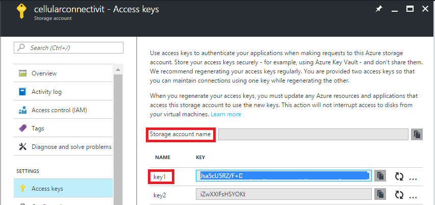
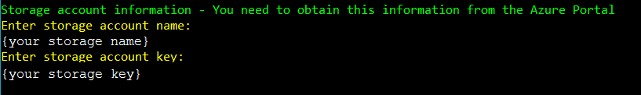
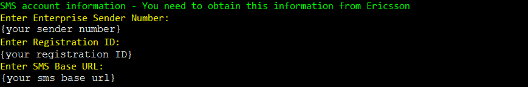
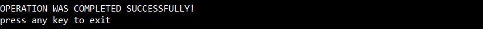

<h1>Ericsson SMS Credential Manager</h1>

<h2>Azure Storage Credentials</h2>

Firstly, you will need to retrieve your storage account name and Key from the Azure portal. This will be in the same 
resource group you deployed your remote monitoring solution to.

 
 

<h2>Running the Tool</h2>
1. Execute the run.bat file
2. Enter Azure storage Credentials

3. Enter Ericsson SMS information

4. You will get a confirmation if the operation is successful.

